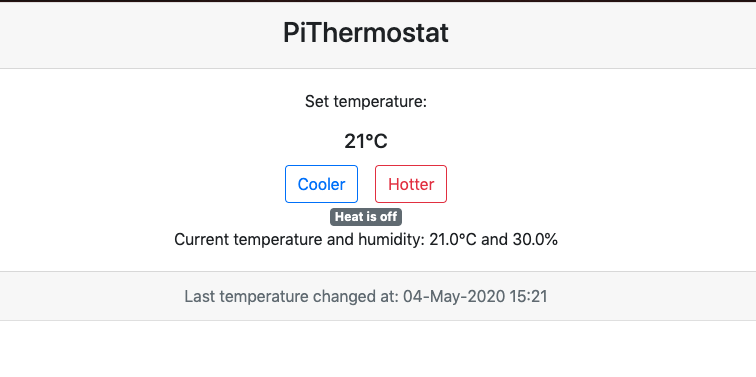
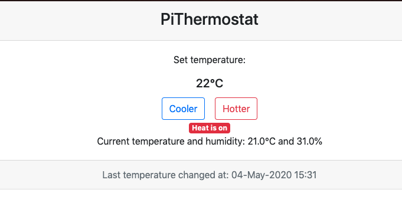

# PiThermostat

Simple DIY thermostat made using RaspberryPi and few components controllable via Web UI.

Easy to control your home temperature via any device:

Setup:
* Hardware
    * Raspberry Pi Zero W
    * DHT 11 Temperature and humidity sensor
    * 5V Relay switch module
* Software
    * Raspbian-lite OS
    * Python Flask app
 